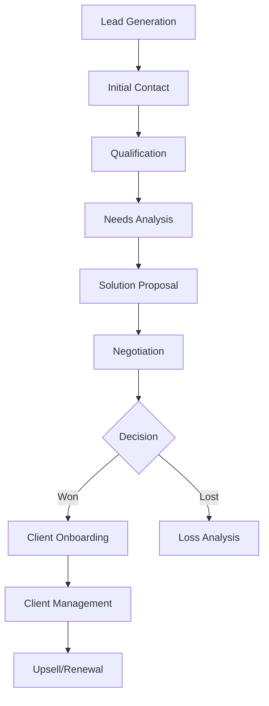

# 🚀 SALES CRM - COMPLETE DEVELOPER IMPLEMENTATION GUIDE

## 📋 Overview
This guide covers ALL modules and features needed to implement a complete sales CRM that handles the full customer journey from lead generation to client management.

## 🔄 COMPLETE SALES WORKFLOW COVERAGE

### **Lead → Prospect → Opportunity → Client Journey**



## 🏗️ MODULE ARCHITECTURE

### **1. AUTHENTICATION MODULE** ✅ (Keep Existing)
- Firebase Auth integration
- Multi-tenant support
- Role-based access (sales_rep, manager)

### **2. USER MANAGEMENT MODULE**
#### Features to Implement:
- **User Registration**: Role assignment, quota setting
- **Profile Management**: Performance tracking, preferences
- **Team Management**: Manager oversight, rep assignment

#### API Endpoints:
```typescript
// User Management
POST   /api/users/register
GET    /api/users/profile
PUT    /api/users/profile
GET    /api/users/team          // Manager only
PUT    /api/users/:id/quota     // Manager only
```

### **3. SALES PIPELINE MODULE**
#### Features to Implement:
- **Stage Configuration**: Custom pipeline stages
- **Stage Progression**: Automatic probability updates
- **Pipeline Visualization**: Kanban board interface

#### API Endpoints:
```typescript
// Sales Stages
GET    /api/sales-stages
POST   /api/sales-stages        // Manager only
PUT    /api/sales-stages/:id    // Manager only
DELETE /api/sales-stages/:id    // Manager only
```

### **4. LEAD MANAGEMENT MODULE**
#### Features to Implement:
- **Lead Capture**: Forms, API webhooks, manual entry
- **Lead Scoring**: Automatic calculation based on source, activities
- **Lead Assignment**: Auto/manual assignment to sales reps
- **Lead Qualification**: BANT process, interest level tracking

#### API Endpoints:
```typescript
// Lead Management
GET    /api/leads
POST   /api/leads
GET    /api/leads/:id
PUT    /api/leads/:id
DELETE /api/leads/:id
POST   /api/leads/:id/convert-to-opportunity
PUT    /api/leads/:id/score
GET    /api/leads/my-leads      // Sales rep's leads
POST   /api/leads/bulk-import
```

#### Frontend Components:
- `LeadForm` - Create/edit leads
- `LeadList` - List with filters and search
- `LeadCard` - Individual lead display
- `LeadScoring` - Score visualization
- `LeadConverter` - Convert to opportunity

### **5. ACCOUNT & CONTACT MODULE**
#### Features to Implement:
- **Account Management**: Company profiles, hierarchy
- **Contact Management**: Decision maker tracking, authority levels
- **Relationship Mapping**: Contact roles, influence tracking

#### API Endpoints:
```typescript
// Account Management
GET    /api/accounts
POST   /api/accounts
GET    /api/accounts/:id
PUT    /api/accounts/:id
DELETE /api/accounts/:id
GET    /api/accounts/:id/contacts
GET    /api/accounts/:id/opportunities

// Contact Management
GET    /api/contacts
POST   /api/contacts
GET    /api/contacts/:id
PUT    /api/contacts/:id
DELETE /api/contacts/:id
```

### **6. OPPORTUNITY MODULE**
#### Features to Implement:
- **Opportunity Creation**: From leads or direct
- **Pipeline Tracking**: Stage progression, probability
- **Sales Process**: BANT/MEDDIC methodology
- **Competition Tracking**: Competitor analysis
- **Win/Loss Analysis**: Outcome tracking with reasons

#### API Endpoints:
```typescript
// Opportunity Management
GET    /api/opportunities
POST   /api/opportunities
GET    /api/opportunities/:id
PUT    /api/opportunities/:id
DELETE /api/opportunities/:id
PUT    /api/opportunities/:id/stage
PUT    /api/opportunities/:id/outcome
GET    /api/opportunities/pipeline
GET    /api/opportunities/forecast
```

#### Frontend Components:
- `OpportunityPipeline` - Kanban board
- `OpportunityForm` - Create/edit opportunities
- `OpportunityCard` - Deal summary
- `CompetitorAnalysis` - Competition tracking
- `WinLossForm` - Outcome recording

### **7. ACTIVITY MANAGEMENT MODULE**
#### Features to Implement:
- **Activity Logging**: Calls, emails, meetings, demos
- **Outcome Tracking**: Positive/negative/neutral results
- **Calendar Integration**: Meeting sync, automatic logging
- **Activity Dashboard**: Personal and team activity feeds

#### API Endpoints:
```typescript
// Activity Management
GET    /api/activities
POST   /api/activities
GET    /api/activities/:id
PUT    /api/activities/:id
DELETE /api/activities/:id
GET    /api/activities/timeline
GET    /api/activities/by-entity/:entityType/:entityId
```

#### Frontend Components:
- `ActivityForm` - Log activities
- `ActivityTimeline` - Chronological view
- `ActivityCard` - Individual activity
- `ActivityDashboard` - Overview
- `CalendarSync` - Calendar integration

### **8. FOLLOW-UP & REMINDER MODULE**
#### Features to Implement:
- **Follow-up Scheduling**: Automatic and manual reminders
- **Task Management**: Priority-based task lists
- **Calendar Integration**: Sync with Google Calendar
- **Notification System**: Email and browser notifications

#### API Endpoints:
```typescript
// Follow-up Management
GET    /api/follow-ups
POST   /api/follow-ups
GET    /api/follow-ups/:id
PUT    /api/follow-ups/:id
DELETE /api/follow-ups/:id
PUT    /api/follow-ups/:id/complete
GET    /api/follow-ups/due
GET    /api/follow-ups/overdue
```

#### Frontend Components:
- `FollowUpList` - Task list with priorities
- `FollowUpForm` - Create reminders
- `FollowUpCalendar` - Calendar view
- `NotificationCenter` - Alerts

### **9. EMAIL & COMMUNICATION MODULE**
#### Features to Implement:
- **Email Templates**: Pre-written templates for different stages
- **Email Sending**: Integration with Resend
- **Email Tracking**: Open/click tracking
- **Communication Log**: All communications history

#### API Endpoints:
```typescript
// Email Management
GET    /api/email-templates
POST   /api/email-templates
PUT    /api/email-templates/:id
DELETE /api/email-templates/:id
POST   /api/emails/send
GET    /api/emails/history/:entityType/:entityId
```

### **10. SALES ANALYTICS MODULE**
#### Features to Implement:
- **Revenue Tracking**: Monthly/quarterly/yearly reports
- **Performance Metrics**: Individual and team KPIs
- **Pipeline Analytics**: Conversion rates, cycle time
- **Forecasting**: Revenue predictions
- **Lost Deal Analysis**: Why deals are lost

#### API Endpoints:
```typescript
// Analytics
GET    /api/analytics/revenue
GET    /api/analytics/pipeline
GET    /api/analytics/performance/:userId
GET    /api/analytics/forecast
GET    /api/analytics/conversion-rates
GET    /api/analytics/lost-deals
```

#### Frontend Components:
- `RevenueDashboard` - Revenue charts
- `PipelineAnalytics` - Conversion funnels
- `PerformanceMetrics` - KPI widgets
- `ForecastChart` - Prediction graphs

### **11. QUOTA & TARGET MODULE**
#### Features to Implement:
- **Quota Setting**: Monthly/quarterly/yearly targets
- **Progress Tracking**: Real-time quota achievement
- **Performance Comparison**: Rep vs team averages
- **Goal Management**: Personal and team goals

#### API Endpoints:
```typescript
// Quota Management
GET    /api/sales-targets
POST   /api/sales-targets
PUT    /api/sales-targets/:id
DELETE /api/sales-targets/:id
GET    /api/sales-targets/progress/:userId
```

### **12. MANAGER OVERSIGHT MODULE**
#### Features to Implement:
- **Team Dashboard**: All team activities and performance
- **Coaching Tools**: Comment and feedback system
- **Deal Review**: Manager approval workflows
- **Performance Monitoring**: Team KPI tracking

#### API Endpoints:
```typescript
// Manager Tools
GET    /api/manager/team-overview
GET    /api/manager/performance
POST   /api/manager/comments
GET    /api/manager/comments/:repId
PUT    /api/manager/comments/:id/mark-read
GET    /api/manager/deals-requiring-review
```

### **13. CLIENT MANAGEMENT MODULE**
#### Features to Implement:
- **Client Onboarding**: Post-sale process tracking
- **Satisfaction Tracking**: CSAT scores, feedback
- **Upsell Management**: Expansion opportunities
- **Renewal Tracking**: Contract renewals

#### API Endpoints:
```typescript
// Client Management
GET    /api/clients
GET    /api/clients/:id/interactions
POST   /api/clients/:id/interactions
GET    /api/clients/satisfaction-scores
POST   /api/clients/:id/feedback
```

### **14. CALENDAR INTEGRATION MODULE**
#### Features to Implement:
- **Google Calendar Sync**: Two-way sync
- **Meeting Scheduling**: Automatic follow-up creation
- **Reminder Management**: Calendar-based notifications
- **Availability Tracking**: Rep availability

#### API Endpoints:
```typescript
// Calendar Integration
GET    /api/calendar/events
POST   /api/calendar/events
PUT    /api/calendar/events/:id
DELETE /api/calendar/events/:id
POST   /api/calendar/sync
GET    /api/calendar/availability/:userId
```

## 🎨 FRONTEND ARCHITECTURE

### **Pages to Build:**

1. **Dashboard Pages**
   - `/dashboard` - Sales rep dashboard
   - `/dashboard/manager` - Manager dashboard

2. **Lead Management**
   - `/leads` - Lead list and filters
   - `/leads/new` - Create lead
   - `/leads/:id` - Lead details

3. **Opportunity Management**
   - `/opportunities` - Pipeline view
   - `/opportunities/new` - Create opportunity
   - `/opportunities/:id` - Opportunity details

4. **Account & Contact Management**
   - `/accounts` - Account list
   - `/accounts/:id` - Account details with contacts
   - `/contacts` - Contact list

5. **Activity & Follow-up Management**
   - `/activities` - Activity timeline
   - `/follow-ups` - Task list
   - `/calendar` - Calendar view

6. **Analytics & Reports**
   - `/analytics/revenue` - Revenue reports
   - `/analytics/pipeline` - Pipeline analytics
   - `/analytics/performance` - Performance metrics

7. **Settings & Administration**
   - `/settings/profile` - User profile
   - `/settings/team` - Team management (manager only)
   - `/settings/pipeline` - Pipeline configuration

### **Key UI Components:**

```typescript
// Core Components
- SalesStageCard
- LeadScoreIndicator
- ActivityTimeline
- RevenueChart
- PipelineKanban
- FollowUpNotification
- ManagerComment
- ClientSatisfactionScore

// Form Components
- LeadForm
- OpportunityForm
- ActivityForm
- FollowUpForm
- ClientInteractionForm

// Dashboard Components
- RevenueDashboard
- PipelineHealth
- ActivityFeed
- QuotaProgress
- TeamPerformance
```

## 📱 MOBILE CONSIDERATIONS

### **PWA Features:**
- Offline capability for lead capture
- Push notifications for follow-ups
- Quick activity logging
- Mobile-optimized forms

## 🔐 SECURITY IMPLEMENTATION

### **Row Level Security:**
- Sales reps see only their records
- Managers see all team records
- Tenant isolation enforced

### **API Security:**
- JWT token validation
- Role-based endpoint access
- Rate limiting on critical endpoints

## 📊 ANALYTICS IMPLEMENTATION

### **Key Metrics to Track:**
- Lead conversion rates by source
- Average deal size and cycle time
- Activity correlation with outcomes
- Revenue per rep/period
- Lost deal reasons

### **Dashboard Widgets:**
- Pipeline health score
- Monthly recurring revenue
- Activity streaks
- Quota achievement
- Team leaderboards

## 🔧 INTEGRATION POINTS

### **Calendar Integration:**
- Google Calendar API
- Automatic meeting logging
- Follow-up scheduling
- Availability management

### **Email Integration:**
- Resend for transactional emails
- Template management
- Email tracking
- Communication history

### **CRM Integrations:**
- Lead import/export APIs
- Webhook endpoints for external systems
- Data synchronization

## 📝 DEVELOPMENT PRIORITIES

### **Phase 1 - Core Sales **
1. Lead management module
2. Opportunity pipeline
3. Basic activity logging
4. Sales stages configuration

### **Phase 2 - Advanced Features **
1. Follow-up management
2. Email templates
3. Basic analytics
4. Manager oversight tools

### **Phase 3 - Integrations **
1. Calendar sync
2. Advanced analytics
3. Client management
4. Performance dashboards

### **Phase 4 - Optimization**
1. Mobile optimization
2. Performance improvements
3. Advanced reporting
4. User experience polish

## 🎯 SUCCESS METRICS

- **Sales Rep Adoption**: Daily active users
- **Data Quality**: Complete lead/opportunity records
- **Performance**: Page load times, API response times
- **Business Impact**: Improved conversion rates, faster sales cycles

This implementation guide provides complete coverage of the sales workflow from lead generation to client management, ensuring no sales action or requirement is missed.